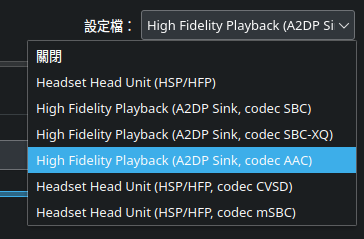
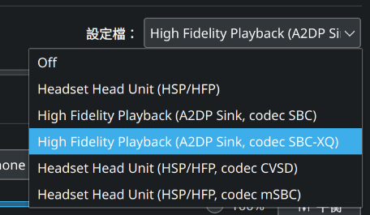

# How to allow the usage of the AAC audio codec for bluetooth audio devices on Ubuntu 24.04

Explains why the AAC audio codec support for bluetooth audio devices isn't available on a Ubuntu 24.04 system, and how to workaround it on your own.

\#pipewire \#ubuntu \#bluetooth \#a2dp \#fdk-aac



<https://gitlab.com/brlin/aac-bluetooth-audio-codec-on-ubuntu-2404>  
[](https://gitlab.com/brlin/aac-bluetooth-audio-codec-on-ubuntu-2404/-/pipelines) [](https://github.com/brlin-tw/aac-bluetooth-audio-codec-on-ubuntu-2404/actions/workflows/check-potential-problems.yml) [](https://pre-commit.com/) [](https://api.reuse.software/info/gitlab.com/brlin/aac-bluetooth-audio-codec-on-ubuntu-2404)

[TOC]

## The problem

The AAC audio codec support for bluetooth audio devices isn't available under Ubuntu 24.04 by default:



This is due to the fact that the FDK-AAC package that provides the support [has a patent-related clause in their BSD-like custom license](https://fedoraproject.org/wiki/Licensing/FDK-AAC), which makes it incompatible with the licenses of the consumer packages(e.g. PulseAudio/Pipewire) and thus can't be legally distributed when linked(it will considered to be violating license terms at either ends).

The FDK-AAC package distributed in Ubuntu is in fact [a stripped-down fork](https://gitlab.freedesktop.org/wtaymans/fdk-aac-stripped) that removes features which the related patents aren't expired yet, which, [as far as Fedora concerned](https://lists.fedoraproject.org/archives/list/legal@lists.fedoraproject.org/thread/OVW25JRWOKOLVMW3XGUX7E4OXFUR2RCG/), is considered free from the license incompatibility problems.  However [the package hasn't moved to the main component of the Ubuntu software archive component yet](https://bugs.launchpad.net/ubuntu/+source/fdk-aac-free/+bug/1977614) and as a result, it cannot be linked by the consumer packages(as they are also required to be included in the Ubuntu installation media, which requires all software to be from the `main` and `restricted` software archive components).

## The solution

The following actions may help the bug be resolved:

* Vote and subscribe to the following Ubuntu bugs:
    + [Bug #1991936 “No AAC codec for Pipewire on Ubuntu Kinetic” : Bugs : pipewire package : Ubuntu](https://bugs.launchpad.net/ubuntu/+source/pipewire/+bug/1991936)
    + [Bug #1977614 “\[MIR\] fdk-aac-free” : Bugs : fdk-aac-free package : Ubuntu](https://bugs.launchpad.net/ubuntu/+source/fdk-aac-free/+bug/1977614)
* Subscribe to the following Debian bug:
    + [#1021370 - pipewire: build with bluez5-codec-aac=enabled - Debian Bug report logs](https://bugs.debian.org/cgi-bin/bugreport.cgi?bug=1021370)
    + [#981285 - Please move fdk-aac to main - Debian Bug report logs](https://bugs.debian.org/cgi-bin/bugreport.cgi?bug=981285)

## The workaround

The following are some workarounds that can help mitigate the problem before a proper solution is rolled out:

### Rebuild the pipewire packages to link with the FDK-AAC package

We can mitigate the problem by rebuilding the pipewire packages and linking them against the FDK-AAC package:

1. Download the release package from [the Releases page](https://gitlab.com/brlin/aac-bluetooth-audio-codec-on-ubuntu-2404/-/releases).
1. Extract the downloaded release package.
1. Launch a text terminal application.
1. Change the working directory to the extracted release package directory by runnint the following commands in the text terminal:

    ```bash
    cd /path/to/aac-bluetooth-audio-codec-on-ubuntu-2404-X.Y.Z
    ```

1. Ensure the local cache of the APT software package management system is fresh by running the following command _as root_ in the text terminal:

    ```bash
    apt update
    ```

1. Run the following commands to download and extract the Debian packaging source tree of the pipewire package in the text terminal:

    ```bash
    apt source pipewire
    ```

1. Run the following command to change the working directory to the extracted pipewire Debian packaging source tree directory as the following operations will require it:

    ```bash
    cd pipewire-1.0.5
    ```

1. Run the following commands to apply [the enable-aac-bluetooth-codec-support.patch patch](patches/enable-aac-bluetooth-codec-support.patch) to the pipewire Debian packaging source tree:

    ```bash
    patch_opts=(
        # Strip one level of the backslash-trailing substring from
        # the content paths
        --strip=1
    )
    patch "${patch_opts[@]}" <../patches/enable-aac-bluetooth-codec-support.patch
    ```

   You should see the following command output:

    ```txt
    patching file debian/control
    patching file debian/rules
    ```

   and the command exit status should be zero:

    ```txt
    pipewire-1.0.5 $ echo $?
    0
    ```

1. Add a entry to the [debian changelog file](pipewire-1.0.5/debian/changelog) in the similar fashion of the following patch does:

    ```patch
    diff --recursive --unified pipewire-1.0.5/debian/changelog pipewire-1.0.5.patched/debian/changelog
    --- pipewire-1.0.5/debian/changelog     2024-05-28 12:18:02.000000000 +0800
    +++ pipewire-1.0.5.patched/debian/changelog     2024-09-09 05:11:12.825469240 +0800
    @@ -1,3 +1,9 @@
    +pipewire (1.0.5-1ubuntu1brlin1) noble; urgency=medium
    +
    +  * Add AAC codec support
    +
    + -- 林博仁(Buo-ren Lin) <buo.ren.lin@gmail.com>  Mon, 9 Sep 2024 05:11:00 +0800
    +
     pipewire (1.0.5-1ubuntu1) noble; urgency=medium

       * Patch to handle long SysEx messages in MIDI bridge (LP: #2067338)
    ```

   This change addes a new package version that is a suffixed one from the previous one, change the suffix according to your preference.

1. Run the following command _as root_ in the text terminal to install the `mk-build-deps` utility:

    ```bash
    apt install devscripts
    ```

1. Run the following command in the text terminal to build a build-dependencies meta-package of the pipewire package:

    ```bash
    mk-build-deps
    ```

1. Install the pipewire build dependencies by running the following command _as root_ in the text terminal:

    ```bash
    sudo apt install ./pipewire-build-deps_*_amd64.deb
    ```

1. Run the following command to build the pipewire binary packages:

    ```bash
    debuild_opts=(
        # Do not run litian after building the packages
        --no-lintian

        # Builds the architecture specific and independent binary packages
        --build=binary

        # Do not sign the .buildinfo and .changes files
        --unsigned-changes

        # Do not sign the source package
        --unsigned-source
    )
    debuild "${debuild_opts[@]}"
    ```

1. Install the built packages by running the following commands _as root_ in a text terminal:

    ```bash
    built_debian_pkgs=(../*.deb)
    package_files_to_be_installed=()
    for package in "${built_debian_pkgs[@]}"; do
        package_filename="${package#../}"
        package_name="${package_filename%%_*}"

        # If package is not installed then skip them
        if ! dpkg --status "${package_name}" &>/dev/null; then
            continue
        else
            package_files_to_be_installed+=("${package}")
        fi
    done

    sudo apt install "${package_files_to_be_installed[@]}"
    ```

1. Run the following commands in the text terminal to restart the pipewire service running in your user seession:

    ```bash
    systemctl_opts=(
        # Talk to the service manager of the calling user, rather than the
        # service manager of the system
        --user
    )
    systemctl "${systemctl_opts[@]}" restart pipewire
    ```

1. Try reproduce the problem again, this time the AAC A2DP audio profile should be enumerated in the profile selection interface.

   

## References

The following external materials are referenced during the writing of this howto:

* [Bug #1977614 “\[MIR\] fdk-aac-free” : Bugs : fdk-aac-free package : Ubuntu](https://bugs.launchpad.net/ubuntu/+source/fdk-aac-free/+bug/1977614)  
  A Ubuntu bug report to migrate the fdk-aac-free package(currently in the `universe` component) to the `main` Ubuntu software archive component.
* [#981285 - Please move fdk-aac to main - Debian Bug report logs](https://bugs.debian.org/cgi-bin/bugreport.cgi?bug=981285)  
  A Debian bug port to move the fdk-aac package to the `main` Debian software archive component, it contains discussion regarding the compatibility of the FDK-AAC license with the GPL licenses used in consumer packages.
* [Licensing/FDK-AAC - Fedora Project Wiki](https://fedoraproject.org/wiki/Licensing/FDK-AAC)  
  Explains the characteristics of the FDK-AAC license.
* [Regarding GPL compatibility of fdk-aac - legal - Fedora mailing-lists](https://lists.fedoraproject.org/archives/list/legal@lists.fedoraproject.org/thread/OVW25JRWOKOLVMW3XGUX7E4OXFUR2RCG/)  
  Explains whether GPL compatibility should be concerned in the Fedora's distribution of the fdk-aac package in the Fedora GNU+Linux distribution.
* [Enable PipeWire on Ubuntu 22.04](https://gist.github.com/the-spyke/2de98b22ff4f978ebf0650c90e82027e)  
  Similar problem but for Ubuntu 22.04.
* The debuild(1) manual page  
  Explains the usage of the `--no-lintian` command option.
* The dpkg-buildpackage(1) manual page  
  Explains the usage of the `--build`, the `--unsigned-changes`, and the `--unsigned-source` command options.

## Licensing

This write-up is licensed under [the 4.0 international version (or any of its more recent versions you prefer) of the Creative Commons Attribution-SharedAlike license](https://creativecommons.org/licenses/by-sa/4.0/deed.en).

If you have any needs that require rights that are not granted by this license, contact <buo.ren.lin+legal@gmail.com> for inquiry.
